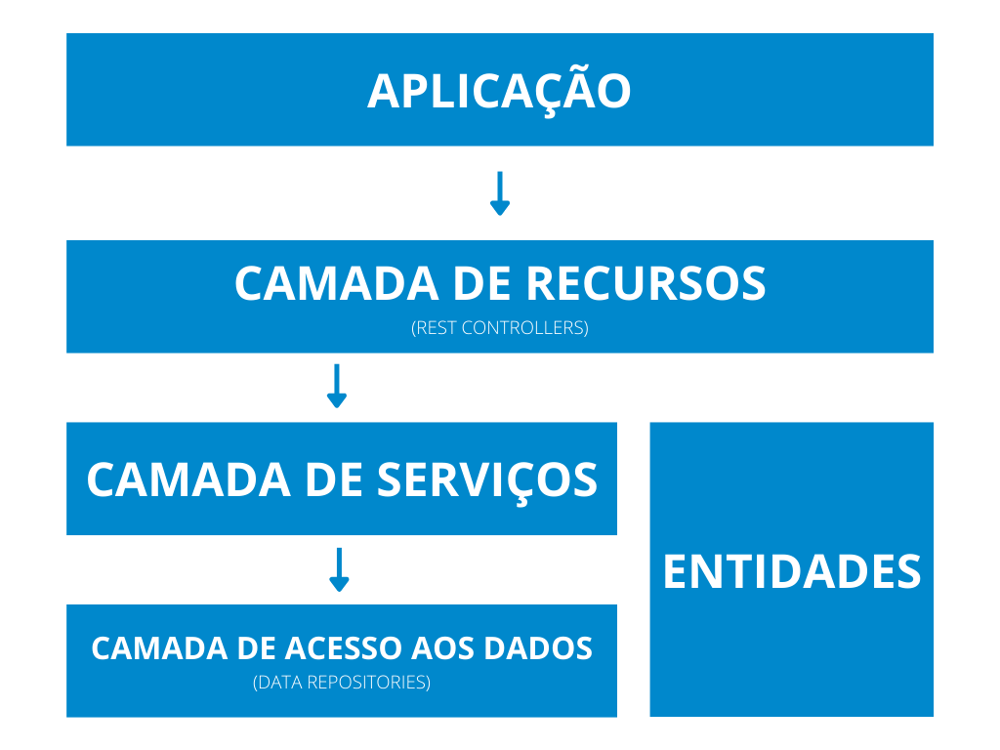
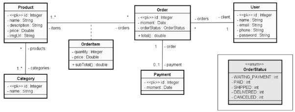
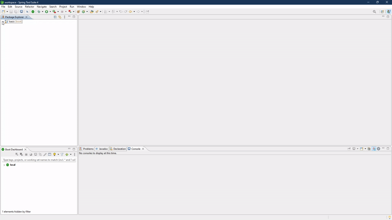

Project for training some basics concepts about Java, SpringBoot, DataBase, PostgreeSQL, Hibernate and Heroku deploy.

### CRIAÇÃO DE UM WEB SERVICE UTILIZANDO O SPRING BOOT FRAMEWORK E A LINGUAGEM JAVA

O processo de criação de um servico para web inicialmente passa pelo etapa definição de uma arquitetura de projeto. Aqui utilizamos os seguintes modelos para arquitetura da API e da base de dados:

 
O modelo de dominio da base de dados:

Para rodar o projeto localmente via Spring Tool Suite 4 seguimos os passos a seguir:

No menu de pacotes navegue até o seguinte arquivo **scr/main/java/com/rodrigues/jeferson/basic/BasicApplication.Java**.

Para executar o programa, clique sobre o arquivo selecionado anteriormente com o botão direito e selecione a opção **Run As -> 4 Spring Boot App**, o processo completo pode ser conferido através do gif ilustrativo abaixo:

